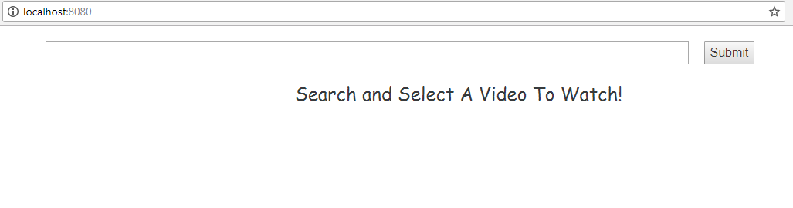
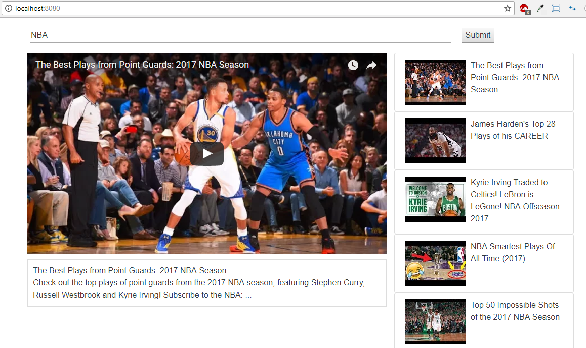

# Youtube-React

### This is a Code-Along To Stephen Grider's [Modern React With Redux](https://www.udemy.com/react-redux/learn/v4/overview). 

#### A user can search for youtube videos after they click submit. Videos will render and the user can play the video in the play section, or click on another video from the sidebar to display in the play section. 

### Changes I made:
* Videos will only render when the user clicks submit on a video search. 

Plain homepage



User can search for a video and clicks submit for videos to render


User can click on another video to render in the play section


### Technologies:
* React
* youtube-api-search npm


### Components Layout


#### Familiar with Git?
Checkout this repo, install dependencies, then start the gulp process with the following:

```
> git clone https://github.com/yabdabs/youtube-react.git
> cd youtube-react
> npm install
> npm start
```
